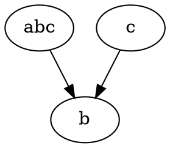

# Test

$$ a = \frac{1}{b}$$

```js
console.log("eval this!");
```

# Graphs via dot and dagreD3




```test
anyGraph("should have b", function(g){
    if(!g._nodes["b"]){
        throw "NO B";
    }
});
it("should work", function(){});
it("should work 2", function(){});
it("should work 3", function(){throw "abc"});
```
